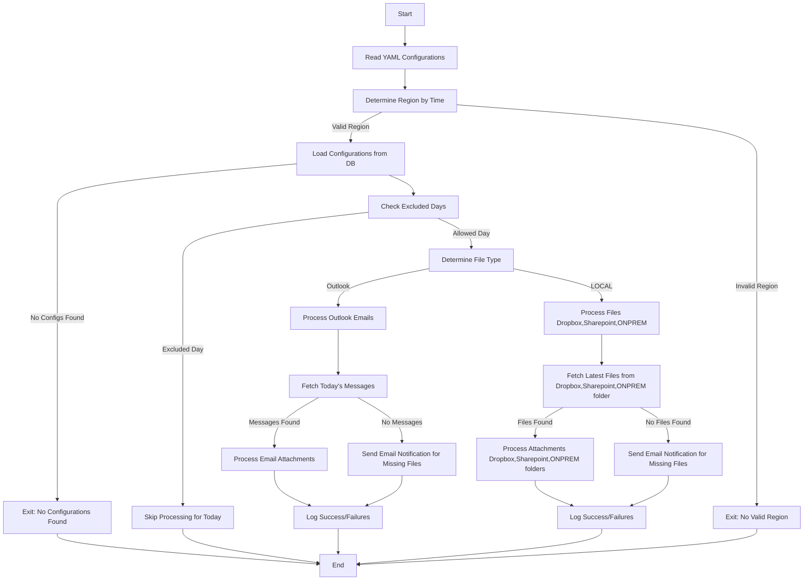

# Outlook Attachment Downloader Framework

This project provides a Python-based framework for automating the process of downloading email attachments from Outlook, processing files from SFTP, and performing additional file operations such as renaming, data validation, and sending notifications. It is designed to be used in a multi-region setup with configurable schedules and logging.

---

## 📘 Overview

The script automates:
- Downloading email attachments from specific Outlook folders.
- Processing files from SFTP servers.
- Performing file operations like renaming, validation, and file type conversion.
- Sending email alerts for missing files.
- Logging all activities with detailed timestamps.

---

## 📦 Dependencies

The script uses the following dependencies:
- `pyodbc`: For SQL Server database interactions.
- `pandas`: For data manipulation.
- `python-dateutil`: For parsing dates.
- `pypiwin32`: For interacting with Outlook.
- `PyYAML`: For reading YAML configuration files.
- `datetime`, `os`, `shutil`, `re`, `logging`, `sys`: Standard Python libraries.

---

## 🌍 Environment Variables

No specific environment variables are required. Ensure that the following configurations are correctly set in the YAML file and database:
- Region-specific schedules.
- Connection details for the SQL database.
- Outlook folder details.

---

## ✅ Features

- **Multi-region support**: Automatically determines the region based on the current time.
- **Outlook integration**: Downloads attachments from specified Outlook folders.
- **SFTP file handling**: Fetches and processes files from SFTP servers directory.
- **File operations**: Renaming, validation, and conversion between file formats.
- **Email notifications**: Alerts for missing files or errors.
- **Logging**: Detailed logs of all activities are stored in the `logs` directory.

---

## 🧰 Prerequisites

### Required Packages
- Python 3.8 or above.
- Required libraries (see dependencies).

### System Requirements
- Microsoft Outlook installed and configured on the system.
- SQL Server ODBC Driver (`ODBC Driver 17 for SQL Server`).

---

## 🔄 Function Workflow

1. **Initialization**:
   - Reads configurations from the YAML file.
   - Determines the region (APJ, AMS, EMEA) based on the current time.
   - Connects to the database to fetch region-specific configurations.

2. **Processing**:
   - Handles files based on their type (`Outlook` or `SFTP`).
   - Downloads attachments or fetches files from SFTP.
   - Performs file operations like renaming, validation, and conversion.

3. **Notification**:
   - Sends email notifications for missing files or errors.

4. **Logging**:
   - Logs all activities for traceability.

---

## ⚙️ Configuration

### YAML Configuration
The YAML file contains region-specific schedules, email settings, and other configurations.

Example:
```yaml
APJ_Start_time: 0
APJ_End_time: 8
AMS_Start_time: 8
AMS_End_time: 16
EMEA_Start_time: 16
EMEA_End_time: 24
smtp_server: "smtp.example.com"
port: 587
sender_email: "example@example.com"
receiver_email: "receiver@example.com"
cc_email: "cc@example.com"
base_directory: "C:\\path\\to\\base\\directory"
success: "Process completed successfully."
failure: "Process failed."
```

### SQL Configuration

The script connects to a SQL Server database to fetch region-specific file configurations. Ensure your database contains the `sc360_extraction_config` and `sc360_extraction_process_log` tables.

- Example `sc360_extraction_config` schema:
  - `file_id`: Unique identifier for the file.
   - `download_path`: Path to the folder where files are downloaded.
   - `folder_name`: Name of the Outlook folder to process.
   - `subfolder_name`: Name of the subfolder inside the Outlook folder.
   - `subject_filter`: Filter for email subject lines.
   - `sheet_name`: Name of the sheet to process in Excel files.
   - `final_dest_path`: Path to the final destination folder for processed files.
   - `extractor_type`: Type of extractor (`outlook` or `sftp`).
   - `type`: Frequency type (e.g., daily, weekly).
   - `exclude_days`: Days to exclude processing (stored as a JSON string).
   - `rename_required`: Indicates whether renaming is required (`true` or `false`).
   - `file_extension_conversion`: Indicates whether file extension conversion is enabled (`true` or `false`).
   - `target_ext`: Target file extension for conversion (e.g., `.xlsx`).
   - `raw_filename`: Name of the raw file to process.
   - `destn_file_name`: Destination filename after processing.
   - `data_validation`: Indicates whether data validation is enabled (`true` or `false`).
   - `field_name`: Name of the field to validate data against.
   - `field_value`: List of values (stored as a JSON string) to validate against the field.
   - `archive_path`: Path to the archive folder for processed files.
   - `min_hour`: Minimum hour for processing files in 24-hour format.
   - `max_hour`: Maximum hour for processing files in 24-hour format.
   - `region`: Region identifier (e.g., APJ, AMS, EMEA).
   - `src_file_name`: Name of the source file.

- Example `sc360_extraction_process_log` schema:
  - `file_id`: Unique identifier for the file.
  - `region`: Region identifier (e.g., APJ, AMS, EMEA).
  - `src_file_name`: Name of the source file.
  - `extractor_type`: Type of extractor (`outlook` or `sftp`).
  - `archive_path`: Path to the archive folder for processed files.
  - `execution_status`: Status of the process (success/failure).
  - `error_msg`: Details of any encountered errors.
  - `run_date`: Date and time of processing.

---

## 🚀 Usage

### Manual Mode
Run with the `WW` region:
```bash
python Automated_File_Extractor.py WW
```

### Auto Mode
Automatically determines the region based on the current time:
```bash
python Automated_File_Extractor.py
```

---

## 🧩 Functions

### `OutlookAttachmentDownloader.__init__(config_path)`
**What It Does**: Initializes the class with configurations from the YAML file.

**Arguments**:
- `config_path`: Path to the YAML configuration file.

**Returns**: None.

---

### `get_region_by_time(APJ_Start_time, APJ_End_time, AMS_Start_time, AMS_End_time, EMEA_Start_time, EMEA_End_time)`
**What It Does**: Determines the region based on the current time.

**Arguments**:
- `APJ_Start_time`, `APJ_End_time`: Start and end times for APJ.
- `AMS_Start_time`, `AMS_End_time`: Start and end times for AMS.
- `EMEA_Start_time`, `EMEA_End_time`: Start and end times for EMEA.

**Returns**: Region (`"APJ"`, `"AMS"`, `"EMEA"`) or `False`.

---

### `read_SLA_time_yaml_file()`
**What It Does**: Reads the SLA timing configurations from the provided YAML file and returns the data as a dictionary.


**Arguments**: None(method uses `self` context only)

**Returns**: Dictionary of configurations or `None`.

---

### `load_config_from_db(region)`
**What It Does**: Connects to the SQL Server database and fetches region-specific configurations for processing files. Returns configurations as a list of dictionaries.

**Arguments**:
- `region`: Region identifier.

**Returns**: List of configurations.

---

### `setup_logging()`
**What It Does**: Sets up logging for the script, including creating log files with timestamps and console logging.

**Arguments**: None(method uses `self` context only)

**Returns**: None.

---

### `is_allowed_today(frequency_config)`
**What It Does**: Checks if file processing is allowed today based on the excluded days specified in the configuration.

**Arguments**:
- `frequency_config`: Frequency configuration dictionary.

**Returns**: `True` if allowed, `False` otherwise.

---

### `is_within_schedule(schedule_config)`
**What It Does**: Checks if the current time falls within the allowed processing schedule based on the start and end times.

**Arguments**:
- `schedule_config`: Schedule configuration dictionary.

**Returns**: `True` if within schedule, `False` otherwise.

---

### `get_extraction_config(file_config)`
**What It Does**: Extracts configuration details for a specific file from the database or YAML configuration and sets them as class attributes.

**Arguments**:
- `file_config`: File configuration dictionary.

**Returns**: None.

---

### `copy_latest_to_target(intermediate_path, target_folder, archive_path)`
**What It Does**: Copies the latest processed file to the target folder and archives it in the archive folder.

**Arguments**:
- `intermediate_path`: Path to the intermediate file.
- `target_folder`: Target folder path.
- `archive_path`: Archive folder path.

**Returns**: None.

---

### `insert_audit_log(execution_status, error_msg="", run_date=None, failure_type=None)`
**What It Does**: Logs the status of the file-processing operation (success or failure) into the `sc360_extraction_process_log` table in the database.

**Arguments**:
- `execution_status`: Status of the execution (`success` or `failure`).
- `error_msg`: Error message (if any).
- `run_date`: Date of the log entry.
- `failure_type`: Specific failure reason(e.g., `SLA_MISSED_EMAIL_SENT`)

**Returns**: None.

---

### `delete_audit_log()`
**What It Does**: Deletes any existing `Failed` audit log entries from the `sc360_extraction_process_log` table for the current file, region, and run date. This is typically used before inserting a new log entry to avoid duplicates or reclassification issues.

**Arguments**: None(method uses `self` context only)

**Returns**: 
- `None`. Logs outcome internally.
- If deletion fails, logs an error message.

---

### `get_processing_and_file_dates()`
**What It Does**: Determines the file’s received date and the processing date-time based on the current UTC time, region, and `date_variable`.
Special handling is applied for the APJ region when `date_variable = "d-1"`, to correctly shift the processing date for late-night file arrivals (between 6:00 PM and 11:59 PM UTC).

**Arguments**: None(method uses `self` context only)

**Returns**: 
- `file_received_date` (`date`): The date when the file is expected to be received.
- `processing_date` (`datetime`): The effective date-time used for logging and audit purposes.

**Example Return for APJ with d-1 at 10 PM UTC**:
- `file_received_date`: Current date
- `processing_date`: Next day with current time

---

### `was_sla_missed_email_sent()`
**What It Does**: Checks the audit log table to determine whether an SLA-missed email has already been sent for the current day, for the given file and region. This prevents duplicate email alerts after the SLA window is exhausted.

**Arguments**: None(method uses `self` context only)

**Returns**: 
- `True` if a log entry with `failure_type = 'SLA_MISSED_EMAIL_SENT'` already exists for today.
- `False` if no such entry is found or in case of an exception.

---

### `fetch_latest_sftp_file(file_config)`
**What It Does**: Fetches the latest files from the specified SFTP folder based on the configuration.

**Arguments**:
- `file_config`: File configuration dictionary.

**Returns**: List of file paths.

---

### `process_sftp_file(file_config)`
**What It Does**: Processes files from the SFTP folder, including downloading, validation, and archiving.

**Arguments**:
- `file_config`: File configuration dictionary.

**Returns**: None.

---

### `connect_to_outlook_folder()`
**What It Does**: Connects to the specified Outlook folder and returns the folder object for processing emails.

**Arguments**: None(method uses `self` context only)

**Returns**: Outlook folder object or `None`.

---

### `process_messages(messages)`
**What It Does**: Processes messages from the Outlook folder, downloads attachments, and applies file operations (e.g., renaming, validation).

**Arguments**:
- `messages`: Outlook messages object.

**Returns**: None.

---

### `convert_file_extension(intermediate_path, file_name)`
**What It Does**: Converts the file extension (e.g., CSV to XLSX).

**Arguments**:
- `intermediate_path`: Path to the intermediate file.
- `file_name`: Name of the file.

**Returns**: New intermediate file path.

---

### `apply_file_renaming(intermediate_path, intermediate_day_folder, file_name)`
**What It Does**: Renames files based on the configuration and validates their content against the specified field values.

**Arguments**:
- `intermediate_path`: Path to the intermediate file.
- `intermediate_day_folder`: Folder for today's files.
- `file_name`: Name of the file.

**Returns**: Final file path or `None`.

---

### `process_attachments(file_paths, received_datetime, intermediate_day_folder, is_local_file=False)`
**What It Does**: Processes email attachments or SFTP files, including saving them to intermediate folders, renaming, and validation.

**Arguments**:
- `file_paths`: List of file paths.
- `received_datetime`: Received timestamp.
- `intermediate_day_folder`: Folder for today's files.
- `is_local_file`: Boolean indicating if files are local.

**Returns**: Count of processed files.

---

### `get_today_messages(inbox)`
**What It Does**: Filters and retrieves emails received today from the specified Outlook folder.

**Arguments**:
- `inbox`: Outlook inbox object.

**Returns**: Filtered messages object or `None`.

---

### `process_outlook_file(file_config)`
**What It Does**: Processes files received via Outlook emails, including fetching messages and downloading attachments.

**Arguments**:
- `file_config`: File configuration dictionary.

**Returns**: None.

---

### `extract_base_filename(file_name)`
**What It Does**: Extracts the base file name from a given file name using regular expressions.

**Arguments**:
- `file_name`: Full file name.

**Returns**: Base file name.

---

### `send_email(sender_email, receiver_email, cc_email, smtp_server, port, subject, Destn_file_name)`
**What It Does**: Sends an email notification if a file is missing or when an error occurs during processing.

**Arguments**:
- `sender_email`: Sender's email address.
- `receiver_email`: Receiver's email address.
- `cc_email`: CC email addresses.
- `smtp_server`: SMTP server address.
- `port`: SMTP server port.
- `subject`: Email subject.
- `Destn_file_name`: Destination file name.

**Returns**: None.

---

### `initialize_and_run()`
**What It Does**: Initializes the script by loading configurations, determining the region, and executing the file-processing logic based on the configuration.

**Arguments**: None(method uses `self` context only)

**Returns**: None.

---

## 🔁 Mermaid Flowchart
